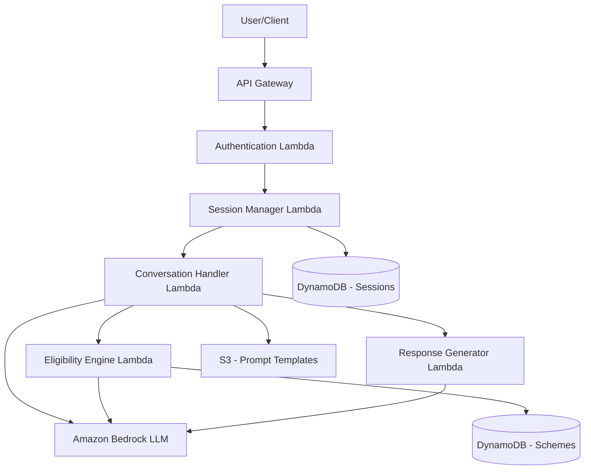

# Design Document: BharatScheme AI

## Overview

BharatScheme AI is a serverless, AI-powered civic information assistant built on AWS infrastructure. The system leverages Amazon Bedrock for LLM capabilities, AWS Lambda for compute, DynamoDB for scheme storage, S3 for static assets, and API Gateway for RESTful endpoints. The architecture follows a microservices pattern with clear separation between conversation management, eligibility reasoning, and response generation.

The system uses a hybrid approach combining structured data retrieval with LLM-powered natural language understanding and generation. This ensures accurate, grounded responses while maintaining conversational flexibility.

## Architecture

### High-Level Architecture



### Component Architecture

**API Layer:**
- API Gateway handles HTTP requests and routing
- Request validation and rate limiting at gateway level
- CORS configuration for web client support

**Compute Layer:**
- Lambda functions for stateless, event-driven processing
- Each Lambda has a single responsibility (session, conversation, eligibility, response)
- Auto-scaling based on request volume

**Data Layer:**
- DynamoDB for scheme data with GSI for efficient querying
- DynamoDB for session state with TTL for automatic cleanup
- S3 for prompt templates and static configuration

**AI Layer:**
- Amazon Bedrock for LLM access (Claude 3 or similar)
- Prompt engineering for consistent, grounded responses
- Structured output parsing for reliability

## Components and Interfaces

### 1. API Gateway

**Endpoints:**

```
POST /api/v1/sessions
- Creates new user session
- Returns: { sessionId, expiresAt }

POST /api/v1/sessions/{sessionId}/messages
- Sends user message and receives response
- Body: { message: string, language?: string }
- Returns: { response: string, schemes?: Scheme[], conversationState: string }

GET /api/v1/sessions/{sessionId}
- Retrieves current session state
- Returns: { sessionId, userProfile, conversationState, expiresAt }

DELETE /api/v1/sessions/{sessionId}
- Terminates session
- Returns: { success: boolean }
```

**Authentication:**
- API key-based authentication for MVP
- Future: Cognito integration for user authentication

### 2. Session Manager Lambda

**Responsibilities:**
- Create and manage user sessions
- Store and retrieve session state from DynamoDB
- Enforce session expiration (30-minute TTL)

**Interface:**

```python
def create_session(request_id: str) -> Session:
    """Creates a new session with unique ID"""
    
def get_session(session_id: str) -> Optional[Session]:
    """Retrieves session by ID"""
    
def update_session(session_id: str, updates: dict) -> Session:
    """Updates session state"""
    
def delete_session(session_id: str) -> bool:
    """Deletes session"""
```

### 3. Conversation Handler Lambda

**Responsibilities:**
- Orchestrate conversation flow
- Determine conversation state (profile_collection, scheme_search, follow_up)
- Route to appropriate handler based on state
- Maintain conversation context

**Interface:**

```python
def handle_message(session_id: str, message: str, language: str) -> ConversationResponse:
    """Main entry point for message handling"""
    
def determine_intent(message: str, context: ConversationContext) -> Intent:
    """Uses LLM to determine user intent"""
    
def extract_profile_info(message: str, current_profile: UserProfile) -> UserProfile:
    """Extracts profile information from natural language"""
    
def is_profile_complete(profile: UserProfile) -> bool:
    """Checks if all required profile fields are present"""
```

### 4. Eligibility Engine Lambda

**Responsibilities:**
- Query scheme database based on user profile
- Apply eligibility rules using structured logic
- Use LLM for complex eligibility reasoning
- Rank schemes by relevance

**Interface:**

```python
def find_eligible_schemes(user_profile: UserProfile) -> List[Scheme]:
    """Returns schemes matching user profile"""
    
def evaluate_eligibility(scheme: Scheme, user_profile: UserProfile) -> EligibilityResult:
    """Determines if user is eligible for specific scheme"""
    
def rank_schemes(schemes: List[Scheme], user_profile: UserProfile) -> List[Scheme]:
    """Ranks schemes by relevance"""
    
def query_schemes_by_criteria(criteria: dict) -> List[Scheme]:
    """Queries DynamoDB with structured criteria"""
```

### 5. Response Generator Lambda

**Responsibilities:**
- Format scheme information for user presentation
- Simplify language using LLM
- Generate step-by-step application guidance
- Add disclaimers and responsible AI messaging

**Interface:**

```python
def generate_scheme_summary(schemes: List[Scheme], language: str) -> str:
    """Generates user-friendly summary of schemes"""
    
def generate_detailed_response(scheme: Scheme, language: str) -> SchemeDetail:
    """Generates detailed scheme information"""
    
def simplify_text(text: str, language: str) -> str:
    """Uses LLM to simplify complex text"""
    
def add_disclaimer(response: str) -> str:
    """Adds responsible AI disclaimer"""
```

### 6. LLM Integration Module

**Responsibilities:**
- Interface with Amazon Bedrock
- Manage prompt templates
- Parse structured outputs
- Handle LLM errors and retries

**Interface:**

```python
def invoke_llm(prompt: str, system_prompt: str, max_tokens: int) -> str:
    """Invokes Bedrock LLM with retry logic"""
    
def invoke_llm_structured(prompt: str, schema: dict) -> dict:
    """Invokes LLM and parses JSON response"""
    
def load_prompt_template(template_name: str) -> str:
    """Loads prompt template from S3"""
    
def validate_llm_response(response: str, expected_format: str) -> bool:
    """Validates LLM response format"""
```

## Data Models

### Session Model (DynamoDB)

```python
{
    "sessionId": "uuid",           # Partition key
    "createdAt": "timestamp",
    "expiresAt": "timestamp",      # TTL attribute
    "userProfile": {
        "age": "integer",
        "incomeRange": "string",   # e.g., "0-2.5L", "2.5L-5L", "5L-10L", "10L+"
        "occupation": "string",    # e.g., "farmer", "student", "self-employed"
        "location": {
            "state": "string",
            "district": "string"
        },
        "category": "string"       # e.g., "General", "SC", "ST", "OBC"
    },
    "conversationState": "string", # "profile_collection", "scheme_search", "follow_up"
    "conversationHistory": [
        {
            "role": "user|assistant",
            "content": "string",
            "timestamp": "timestamp"
        }
    ],
    "language": "string"           # "en", "hi", "ta", etc.
}
```

### Scheme Model (DynamoDB)

```python
{
    "schemeId": "uuid",                    # Partition key
    "schemeName": "string",
    "schemeType": "string",                # "central" or "state"
    "state": "string",                     # For state schemes, null for central
    "description": "string",
    "eligibilityCriteria": {
        "age": {
            "min": "integer",
            "max": "integer"
        },
        "incomeRange": ["string"],         # List of acceptable income ranges
        "occupation": ["string"],          # List of acceptable occupations
        "category": ["string"],            # List of acceptable categories
        "location": {
            "states": ["string"],          # Empty for all states
            "districts": ["string"]        # Empty for all districts
        },
        "additionalCriteria": "string"     # Free text for complex criteria
    },
    "benefits": "string",
    "requiredDocuments": ["string"],
    "applicationProcess": [
        {
            "step": "integer",
            "description": "string"
        }
    ],
    "sourceUrl": "string",
    "lastUpdated": "timestamp",
    "isActive": "boolean",
    
    # GSI attributes for efficient querying
    "gsi_state": "string",                 # GSI partition key
    "gsi_category": "string"               # GSI sort key
}
```

### Conversation Response Model

```python
{
    "response": "string",                  # Main response text
    "schemes": [                           # Optional, when schemes are found
        {
            "schemeId": "string",
            "schemeName": "string",
            "summary": "string",
            "relevanceScore": "float"
        }
    ],
    "conversationState": "string",
    "needsMoreInfo": "boolean",
    "suggestedQuestions": ["string"]       # Optional follow-up suggestions
}
```

### Eligibility Result Model

```python
{
    "isEligible": "boolean",
    "confidence": "float",                 # 0.0 to 1.0
    "matchedCriteria": ["string"],
    "unmatchedCriteria": ["string"],
    "reasoning": "string"                  # LLM-generated explanation
}
```

## LLM Integration Patterns

### Prompt Engineering Strategy

**System Prompts:**

1. **Intent Classification Prompt:**
```
You are an assistant helping Indian citizens find government schemes. 
Analyze the user's message and determine their intent.

Possible intents:
- provide_profile_info: User is providing age, income, occupation, location, or category
- search_schemes: User wants to find schemes they're eligible for
- ask_details: User is asking about a specific scheme
- general_question: User has a general question

Return JSON: {"intent": "<intent>", "confidence": <0-1>}
```

2. **Profile Extraction Prompt:**
```
Extract profile information from the user's message.
Look for: age, income range, occupation, location (state/district), category.

Return JSON with extracted fields. Use null for missing fields.
```

3. **Eligibility Reasoning Prompt:**
```
You are evaluating if a user is eligible for a government scheme.

User Profile: {profile}
Scheme Eligibility Criteria: {criteria}

Determine if the user meets ALL mandatory criteria. For complex criteria, 
reason step-by-step. Return JSON:
{
  "isEligible": boolean,
  "confidence": 0-1,
  "reasoning": "explanation"
}
```

4. **Response Simplification Prompt:**
```
Simplify the following text for users with low digital literacy.
Use simple words, short sentences, and common Hindi/English terms.
Avoid jargon and technical language.

Text: {text}

Return simplified version in {language}.
```

### Structured Output Parsing

- Use JSON mode in Bedrock for structured outputs
- Validate JSON schema before processing
- Fallback to regex parsing if JSON parsing fails
- Log parsing failures for monitoring

### Error Handling

- Retry with exponential backoff (3 attempts)
- Fallback to rule-based logic if LLM fails
- Return user-friendly error messages
- Log all LLM interactions for debugging

## Responsible AI Safeguards

### Grounding and Validation

1. **Response Grounding:**
   - All scheme information must come from Scheme_Database
   - LLM cannot fabricate scheme names or benefits
   - Validate LLM responses against database records

2. **Confidence Thresholds:**
   - Eligibility confidence < 0.7: Show uncertainty message
   - Recommend contacting official sources for borderline cases

3. **Disclaimer Injection:**
   - Every response includes: "This information is for guidance only. Please verify eligibility with official government sources."
   - Link to official scheme websites when available

### Privacy and Data Protection

1. **Session Data:**
   - No PII stored beyond session duration
   - 30-minute TTL on session data
   - No logging of user profile information

2. **Anonymization:**
   - Request IDs used for tracking, not user identifiers
   - Aggregate metrics only, no individual tracking

### Bias Mitigation

1. **Inclusive Language:**
   - Avoid assumptions about user capabilities
   - Use neutral, respectful language
   - Test with diverse user personas

2. **Equal Access:**
   - All schemes presented without bias
   - No preferential ranking based on scheme type
   - Clear eligibility criteria for all schemes

### Content Safety

1. **Input Validation:**
   - Sanitize user inputs
   - Reject inappropriate content
   - Rate limiting to prevent abuse

2. **Output Monitoring:**
   - Log LLM responses for quality review
   - Alert on unexpected response patterns
   - Regular audits of generated content

## Error Handling

### Error Categories

1. **Client Errors (4xx):**
   - Invalid session ID: Return 404 with message to create new session
   - Malformed request: Return 400 with validation errors
   - Rate limit exceeded: Return 429 with retry-after header

2. **Server Errors (5xx):**
   - LLM service unavailable: Return 503 with retry message
   - Database unavailable: Return 503 with temporary unavailability message
   - Unexpected errors: Return 500 with generic error message

### Retry Logic

```python
def invoke_with_retry(func, max_attempts=3, backoff_factor=2):
    """
    Retry logic with exponential backoff
    """
    for attempt in range(max_attempts):
        try:
            return func()
        except TransientError as e:
            if attempt == max_attempts - 1:
                raise
            wait_time = backoff_factor ** attempt
            time.sleep(wait_time)
    raise MaxRetriesExceeded()
```

### Graceful Degradation

1. **LLM Unavailable:**
   - Fall back to rule-based eligibility checking
   - Use pre-generated scheme summaries
   - Inform user of limited functionality

2. **Database Unavailable:**
   - Return cached popular schemes
   - Inform user to retry later
   - Log incident for investigation

3. **Partial Failures:**
   - Return partial results with disclaimer
   - Indicate which components failed
   - Offer retry option


## Correctness Properties

*A property is a characteristic or behavior that should hold true across all valid executions of a system—essentially, a formal statement about what the system should do. Properties serve as the bridge between human-readable specifications and machine-verifiable correctness guarantees.*

### Property 1: Profile Validation Consistency

*For any* user profile input, validation should consistently accept valid values and reject invalid values according to predefined acceptable ranges for age, income range, occupation, location, and category.

**Validates: Requirements 1.2**

### Property 2: Invalid Input Error Response

*For any* invalid profile field input, the system should return an error response containing a clear error message and indication of which field failed validation.

**Validates: Requirements 1.3**

### Property 3: Profile Storage Round-Trip

*For any* complete user profile, storing it in a session and then retrieving that session should return an equivalent profile with all fields preserved.

**Validates: Requirements 1.4**

### Property 4: Natural Language Profile Extraction

*For any* semantically equivalent natural language inputs expressing the same profile information (e.g., "I am 25 years old" vs "My age is 25"), the extracted profile fields should be equivalent.

**Validates: Requirements 1.5**

### Property 5: Complete Scheme Evaluation

*For any* complete user profile and scheme database state, the eligibility engine should evaluate a number of schemes equal to the total number of active schemes in the database.

**Validates: Requirements 2.1**

### Property 6: Scheme Relevance Ranking

*For any* set of eligible schemes returned for a user profile, the schemes should be ordered by relevance score in descending order.

**Validates: Requirements 2.3**

### Property 7: Eligibility Criteria Satisfaction

*For any* scheme returned as eligible for a user profile, the user profile should satisfy all mandatory eligibility criteria defined for that scheme.

**Validates: Requirements 2.4**

### Property 8: Complete Scheme Information

*For any* scheme presented to a user, the response should include all required elements: eligibility criteria, benefits, required documents, and application steps.

**Validates: Requirements 3.1**

### Property 9: Scheme Presentation Ordering

*For any* response presenting multiple schemes, the schemes should appear in the same order as their relevance ranking.

**Validates: Requirements 3.3**

### Property 10: Application Steps Sequential Ordering

*For any* scheme with application steps, the steps should be numbered sequentially starting from 1 with no gaps in the sequence.

**Validates: Requirements 3.5**

### Property 11: Conversation Context Preservation

*For any* conversation sequence, information provided by the user in earlier messages should be accessible and correctly referenced in responses to later messages within the same session.

**Validates: Requirements 4.2**

### Property 12: Phrasing Variation Equivalence

*For any* two semantically equivalent questions phrased differently (e.g., "What schemes can I get?" vs "Which programs am I eligible for?"), the system should return responses with equivalent scheme recommendations.

**Validates: Requirements 4.4**

### Property 13: Scheme Lookup Completeness

*For any* valid scheme name or ID provided by a user, the system should retrieve and return the complete details for that specific scheme.

**Validates: Requirements 4.5**

### Property 14: Scheme Data Model Completeness

*For any* scheme stored in the database, all required fields (name, description, eligibility criteria, benefits, required documents, application process, source URL) should be present and non-null.

**Validates: Requirements 5.1**

### Property 15: Eligibility Criteria Structure Validity

*For any* scheme's eligibility criteria stored in the database, the criteria should conform to the defined schema and be parseable as structured rules.

**Validates: Requirements 5.2**

### Property 16: Scheme Type Support

*For any* scheme stored in the database, it should be categorized as either "central" or "state" type, and both types should be queryable.

**Validates: Requirements 5.3**

### Property 17: Scheme Update Consistency

*For any* scheme, if its data is updated and then queried, the query should return the updated data, not the previous version.

**Validates: Requirements 5.4**

### Property 18: Scheme Metadata Presence

*For any* scheme in the database, the metadata fields (lastUpdated timestamp and data source) should be present and valid.

**Validates: Requirements 5.5**

### Property 19: Disclaimer Inclusion

*For any* response presenting scheme information, the response text should contain the required disclaimer about information being for guidance only.

**Validates: Requirements 6.1**

### Property 20: Response Grounding in Database

*For any* scheme mentioned in a system response, that scheme should exist in the Scheme_Database with matching name and details.

**Validates: Requirements 6.2, 6.4**

### Property 21: Low Confidence Uncertainty Indication

*For any* eligibility determination with confidence score below 0.7, the response should include uncertainty language and recommendation to contact official sources.

**Validates: Requirements 6.3**

### Property 22: Session Data Expiration

*For any* session, after the TTL expiration time has passed, querying for that session should return no data or a session-not-found error.

**Validates: Requirements 6.5**

### Property 23: Language Preference Persistence

*For any* session where a language preference is set, subsequent queries in that session should return responses in the specified language.

**Validates: Requirements 7.2, 7.3, 7.5**

### Property 24: Scheme Name Consistency Across Languages

*For any* scheme presented in multiple languages, the official scheme name should remain identical (untranslated) across all language versions.

**Validates: Requirements 7.4**

### Property 25: Authentication Validation

*For any* API request without valid authentication credentials, the system should reject the request with a 401 or 403 status code.

**Validates: Requirements 8.3**

### Property 26: Validation Error Response Format

*For any* API request that fails validation, the response should include an appropriate 4xx HTTP status code and a JSON error message describing the validation failure.

**Validates: Requirements 8.4**

### Property 27: JSON Response Structure Consistency

*For any* successful API response, the response body should be valid JSON conforming to the defined response schema for that endpoint.

**Validates: Requirements 8.5**

### Property 28: Error Logging and Generic Response

*For any* unexpected error during request processing, the system should log detailed error information and return a generic error message to the user (not exposing internal details).

**Validates: Requirements 10.3**

### Property 29: Retry with Exponential Backoff

*For any* transient failure (e.g., temporary service unavailability), the system should retry the operation with exponentially increasing wait times between attempts.

**Validates: Requirements 10.4**

## Testing Strategy

### Dual Testing Approach

The testing strategy employs both unit testing and property-based testing to ensure comprehensive coverage:

**Unit Tests:**
- Specific examples demonstrating correct behavior
- Edge cases (empty inputs, boundary values, special characters)
- Error conditions (invalid auth, missing data, service failures)
- Integration points between components
- Mock external dependencies (Bedrock, DynamoDB)

**Property-Based Tests:**
- Universal properties that hold for all inputs
- Comprehensive input coverage through randomization
- Validate correctness properties defined in this document
- Minimum 100 iterations per property test
- Each test tagged with feature name and property number

### Property-Based Testing Framework

**Framework Selection:**
- **Python**: Use `hypothesis` library for property-based testing
- **TypeScript/JavaScript**: Use `fast-check` library

**Test Configuration:**
```python
# Python example with hypothesis
@given(user_profile=user_profile_strategy())
@settings(max_examples=100)
def test_property_3_profile_storage_round_trip(user_profile):
    """
    Feature: bharatscheme-ai, Property 3: Profile Storage Round-Trip
    For any complete user profile, storing it in a session and then 
    retrieving that session should return an equivalent profile.
    """
    session_id = create_session()
    store_profile(session_id, user_profile)
    retrieved_session = get_session(session_id)
    assert retrieved_session.user_profile == user_profile
```

### Test Organization

```
tests/
├── unit/
│   ├── test_session_manager.py
│   ├── test_conversation_handler.py
│   ├── test_eligibility_engine.py
│   ├── test_response_generator.py
│   └── test_llm_integration.py
├── property/
│   ├── test_profile_properties.py
│   ├── test_eligibility_properties.py
│   ├── test_conversation_properties.py
│   ├── test_data_properties.py
│   └── test_api_properties.py
├── integration/
│   ├── test_end_to_end_flow.py
│   └── test_api_endpoints.py
└── fixtures/
    ├── sample_schemes.json
    ├── sample_profiles.json
    └── prompt_templates/
```

### Test Data Generators

**For Property-Based Tests:**

```python
from hypothesis import strategies as st

# User profile generator
@st.composite
def user_profile_strategy(draw):
    return UserProfile(
        age=draw(st.integers(min_value=0, max_value=120)),
        income_range=draw(st.sampled_from(["0-2.5L", "2.5L-5L", "5L-10L", "10L+"])),
        occupation=draw(st.sampled_from(["farmer", "student", "self-employed", "salaried", "unemployed"])),
        location=draw(location_strategy()),
        category=draw(st.sampled_from(["General", "SC", "ST", "OBC"]))
    )

# Scheme generator
@st.composite
def scheme_strategy(draw):
    return Scheme(
        scheme_id=draw(st.uuids()),
        scheme_name=draw(st.text(min_size=5, max_size=100)),
        scheme_type=draw(st.sampled_from(["central", "state"])),
        # ... other fields
    )

# Natural language variation generator
@st.composite
def age_phrase_strategy(draw):
    age = draw(st.integers(min_value=18, max_value=100))
    template = draw(st.sampled_from([
        f"I am {age} years old",
        f"My age is {age}",
        f"{age} years",
        f"Age: {age}"
    ]))
    return (age, template)
```

### Integration Testing

**End-to-End Flow Tests:**
1. Create session → Provide profile → Get scheme recommendations → Ask follow-up
2. Test with various user personas (farmer, student, senior citizen)
3. Test error scenarios (invalid input, service failures)
4. Test multi-language flows

**API Contract Tests:**
- Validate request/response schemas
- Test authentication and authorization
- Test rate limiting
- Test CORS configuration

### Mocking Strategy

**External Services:**
- Mock Amazon Bedrock responses for deterministic testing
- Mock DynamoDB for unit tests (use local DynamoDB for integration)
- Mock S3 for prompt template loading

**Test Doubles:**
```python
class MockBedrockClient:
    def invoke_model(self, prompt, **kwargs):
        # Return deterministic responses based on prompt patterns
        if "extract profile" in prompt:
            return {"age": 25, "occupation": "student"}
        elif "determine eligibility" in prompt:
            return {"isEligible": True, "confidence": 0.9}
```

### Coverage Goals

- **Unit Test Coverage**: Minimum 80% code coverage
- **Property Test Coverage**: All 29 correctness properties implemented
- **Integration Test Coverage**: All API endpoints and critical user flows
- **Edge Case Coverage**: All error conditions and boundary values

### Continuous Testing

- Run unit tests on every commit
- Run property tests (with reduced iterations) on every PR
- Run full property test suite (100+ iterations) nightly
- Run integration tests before deployment
- Monitor test execution time and flakiness

### Test Maintenance

- Review and update test data generators quarterly
- Add new property tests when new requirements are added
- Refactor tests when implementation changes
- Document test failures and resolutions
- Regular review of test coverage metrics
